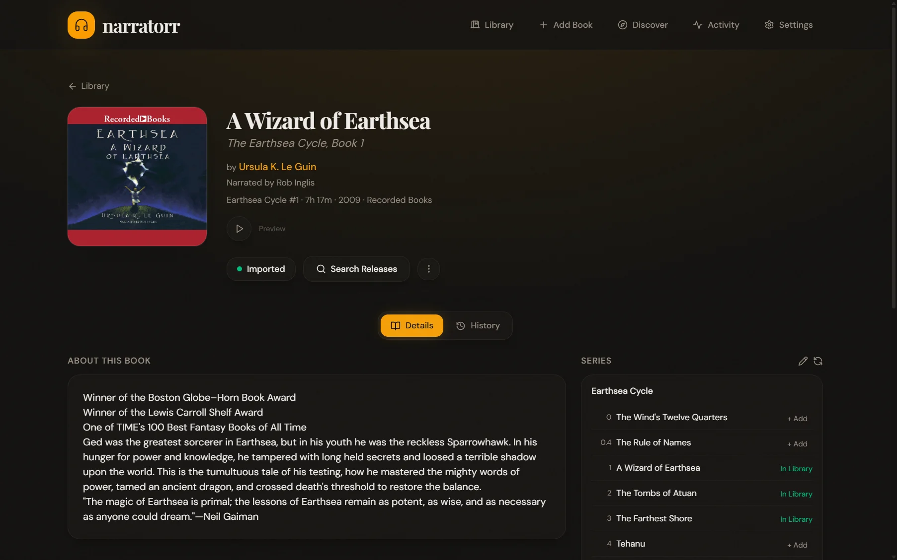
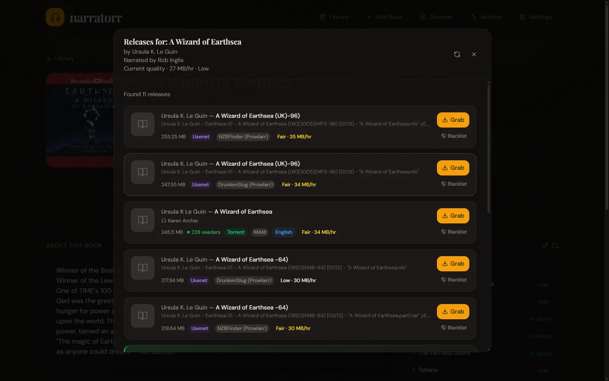
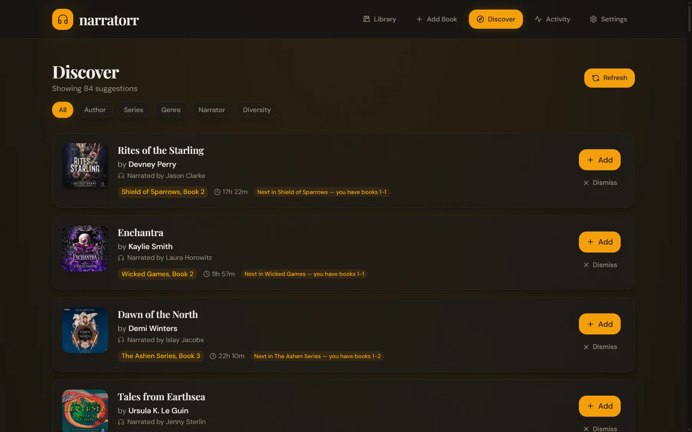

# Narratorr

> *arr for audiobooks

<p align="center">
  
</p>

Narratorr is the automation layer for your audiobook library: it searches your indexers, sends releases to your download client, and imports finished downloads into a clean, organized folder structure — ready for Audiobookshelf, Plex, or however you listen. The missing piece between "I want this book" and "it's on my shelf."

**[Documentation](https://docs.narratorr.dev)** | **[Changelog](CHANGELOG.md)** | **[Security](SECURITY.md)**

## Features

- **Search & Grab** — Search Torznab, Newznab, and private tracker indexers. Grab releases to qBittorrent, Transmission, Deluge, SABnzbd, NZBGet, or a blackhole watch folder.
- **Automated Pipeline** — Scheduled search for wanted books, RSS polling for wanted books, retry with blacklisting.
- **Quality Gate** — Auto-import the first qualifying release for a wanted book and hold questionable ones for manual review. Imported books are never automatically replaced — re-importing a better version is a deliberate, manual choice.
- **Library Management** — Configurable folder/file naming, audio enrichment from file tags, grid and list views with filtering and bulk actions.
- **Discovery** — Personalized book suggestions based on your library: author affinity, series completion, genre, narrator, and diversity signals.
- **Audio Processing** — Optional FFmpeg-based conversion, merging, cover art embedding, and metadata tag embedding (author, title, narrator, series, plus the media-server set: subtitle, ASIN, publisher, description, year, and genre).
- **Notifications** — Discord, Slack, Telegram, Pushover, Gotify, Ntfy, email, and generic webhooks.
- **Import Lists** — Sync wanted books from external sources.
- **Security** — Forms or Basic auth with CSRF defenses, rate-limited login, AES-256-GCM credential encryption at rest, CSP with nonce-based script execution, SSRF protection on attacker-influenced fetches, library-root ancestry checks on filesystem mutations.
- **Docker** — Multi-arch images (amd64/arm64) with linuxserver.io base and s6-overlay.

## Screenshots

<table>
<tr>
<td width="50%"><br><sub><b>Book detail</b> — metadata, narrator, audio quality, and live series tracking</sub></td>
<td width="50%"><br><sub><b>Search</b> — releases across every indexer, with quality, size, and seeders</sub></td>
</tr>
<tr>
<td><br><sub><b>Discover</b> — personalized suggestions from your own library</sub></td>
<td valign="top"><br><sub>More in the <b><a href="https://docs.narratorr.dev">documentation</a></b>.</sub></td>
</tr>
</table>

## Quick Start

### Docker (recommended)

```bash
docker compose pull
docker compose up -d
```

Edit `docker-compose.yml` to set your volume paths:

```yaml
environment:
  - PUID=1000                           # Container process UID (default: 911)
  - PGID=1000                           # Container process GID (default: 911)
volumes:
  - ./config:/config                    # Database and config
  - /path/to/audiobooks:/audiobooks     # Your audiobook library
  - /path/to/downloads:/downloads       # Download client save path
```

Open `http://localhost:3000` and follow the setup wizard.

**Image tags:**

| Tag | Description |
|-----|-------------|
| `latest` | Most recent release |
| `1.0.0` | Specific version |
| `1.0` | Latest patch for a major.minor series |

### Bare Metal

```bash
git clone https://github.com/tjiddy/narratorr.git
cd narratorr
pnpm install
pnpm dev
```

Requires Node.js 24+ and pnpm 10+. The dev server starts on `http://localhost:3000` (API) and `http://localhost:5173` (Vite).

## Configuration

Once running, configure these in **Settings**:

1. **Download Client** — Add your torrent or usenet client (qBittorrent, Transmission, Deluge, SABnzbd, NZBGet, or blackhole). Click **Test** to verify.
2. **Indexer** — Add your Torznab or Newznab indexer (or sync from Prowlarr). Click **Test** to verify.
3. **Library Path** — Set where imported audiobooks are stored and configure the folder/file naming format.

That's it. Search for a book, grab a release, and Narratorr handles the rest.

See the **[documentation](https://docs.narratorr.dev)** for detailed configuration guides.

## Tech Stack

| Layer | Technology |
|-------|------------|
| Package Manager | pnpm |
| Backend | Node.js 24, Fastify 5 |
| Database | SQLite (libSQL) + Drizzle ORM |
| Frontend | React 19 + Vite 8 |
| Data Fetching | TanStack Query |
| Styling | Tailwind CSS |
| Deployment | Docker (linuxserver.io base) |

## Project Structure

```
src/
  server/           # Fastify backend (routes, services, jobs)
  client/           # React frontend (pages, components, lib)
  shared/           # Zod schemas and registries
  core/             # Indexer, download client, and metadata adapters
  db/               # Drizzle ORM schema and migrations
```

## Environment Variables

| Variable | Default | Description |
|----------|---------|-------------|
| `PORT` | `3000` | Server port |
| `NODE_ENV` | (unset) | Environment. Only `production` enables security headers and restricts CORS; any other value (including unset) runs in development mode |
| `CONFIG_PATH` | `./config` | Config and database directory |
| `DATABASE_URL` | `./config/narratorr.db` | SQLite database path (`file:` prefix optional) |
| `URL_BASE` | `/` | Subpath for reverse-proxy deployments |
| `CORS_ORIGIN` | `http://localhost:5173` | Allowed browser origin in production |
| `TRUSTED_PROXIES` | (unset) | Comma-separated reverse-proxy IPs/CIDRs so the real client IP is read from `X-Forwarded-For`. Set this when behind a proxy — required for forms-auth `Secure` cookies and local-network bypass. See [SECURITY.md](SECURITY.md) |
| `AUTH_BYPASS` | `false` | Disable authentication globally; isolated environments only |
| `LOG_LEVEL` | `info` | Log verbosity: `fatal`, `error`, `warn`, `info`, `debug`, `trace`, `silent` |
| `MONITOR_INTERVAL_CRON` | `*/30 * * * * *` | Download-monitor poll cadence (cron expression) |
| `NARRATORR_SECRET_KEY` | (auto-generated) | 32-byte hex key encrypting credentials at rest |

## Development

```bash
pnpm dev            # Dev servers (API :3000, Vite :5173)
pnpm build          # Build for production
pnpm test           # Run tests
pnpm typecheck      # Type check
pnpm lint           # Lint
pnpm verify         # Lint + test + typecheck + build (run before pushing)
pnpm db:generate    # Generate new database migration
```

See [CONTRIBUTING.md](CONTRIBUTING.md) for the full development workflow.

## License

GPL-3.0 — see [LICENSE](LICENSE) for details.

## Acknowledgments

Inspired by the *arr ecosystem and the self-hosted media community.
